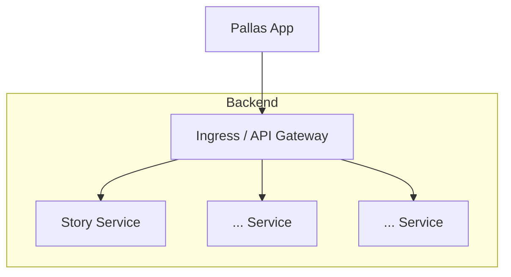
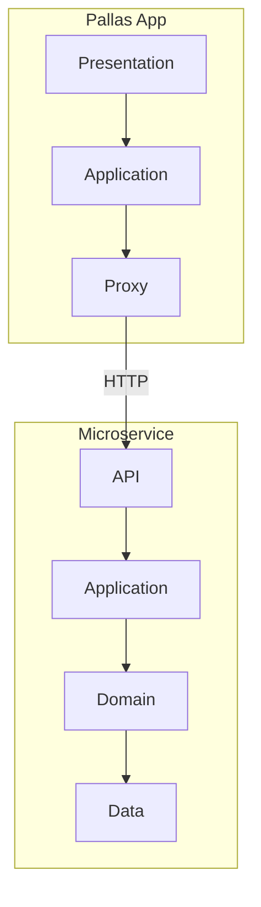

# Introduction

## Domain Vision

Pallas Today is a European social media platform built on the values of privacy, security, and intellectual honesty. It
is designed to bring people together and support collective pursuit of truth — independent of the commercial and
political pressures that shape existing platforms.

## Vision

A secure, privacy-respecting social media platform that connects people across Europe and empowers them to seek truth
together, free from the influence of large commercial platforms.

## Mission

To build an open, trustworthy social platform that prioritises user privacy and security, fosters genuine connection,
and is developed and hosted independently within Europe.

______________________________________________________________________

## System Structure

Pallas Today consists of a cross-platform mobile and desktop application backed by a set of independently deployable
microservices. This section introduces the overall structure from two complementary perspectives: the service
decomposition (vertical slices) and the internal layering within each component (horizontal slices).

A key architectural principle follows directly from this structure: **all domain logic resides in the backend**. The
Pallas Today App contains no business rules; it is solely responsible for presenting information and translating user
interactions into API calls. This keeps the domain model coherent and backend-authoritative, regardless of which client
or platform accesses it.

### Services and Components

The system is composed of the following main building blocks:

- **Pallas App** — the cross-platform frontend, targeting mobile and desktop platforms.
- **Backend services** — a collection of microservices, each responsible for a specific functional domain.
- **Ingress** — acts as an API gateway, routing client requests to the appropriate backend service.

Functionality is distributed across microservices along vertical slices: each service owns a distinct piece of domain
behaviour end-to-end.

### Layering Within Components

While the system is decomposed into microservices, each component still follows a layered internal structure inspired by
Domain-Driven Design.

**Pallas App** is organised in three layers:

| Layer        | Responsibility                                                       |
| ------------ | -------------------------------------------------------------------- |
| Presentation | Implements the user interface.                                       |
| Application  | Translates UI interactions into calls to the backend.                |
| Proxy        | Generated HTTP client code, derived from the OpenAPI specifications. |

The proxy layer is a technical addition outside the DDD model; it keeps generated code clearly separated from
hand-written application logic.

**Each microservice** is organised in four layers:

| Layer       | Responsibility                                        |
| ----------- | ----------------------------------------------------- |
| API         | Implements the HTTP endpoints exposed to clients.     |
| Application | Orchestrates use cases; may call other microservices. |
| Domain      | Contains the business logic and domain model.         |
| Data        | Manages interaction with persistent storage.          |

The API layer, like the proxy layer in the app, is a technical addition that keeps transport concerns separate from the
domain model.

### Bounded Contexts

Each component — the Pallas App and every microservice — defines its own bounded context. Within a bounded context, the
domain model and its language are self-contained and consistent; concepts are not shared across context boundaries.

Components communicate through a **shared kernel**: the OpenAPI specifications stored in `api-specs/`. These
specifications define the contract between contexts — the data structures and operations that cross a boundary. Keeping
the shared kernel minimal and explicitly versioned prevents tight coupling between services while still enabling
structured collaboration.

This means:

- A microservice owns its domain model entirely; no other component reaches into it directly.
- The OpenAPI spec for a service is the single authoritative definition of what it exposes to the outside world.
- The Pallas App consumes these contracts via generated proxy code, ensuring client and server always agree on the
  interface without sharing implementation.
