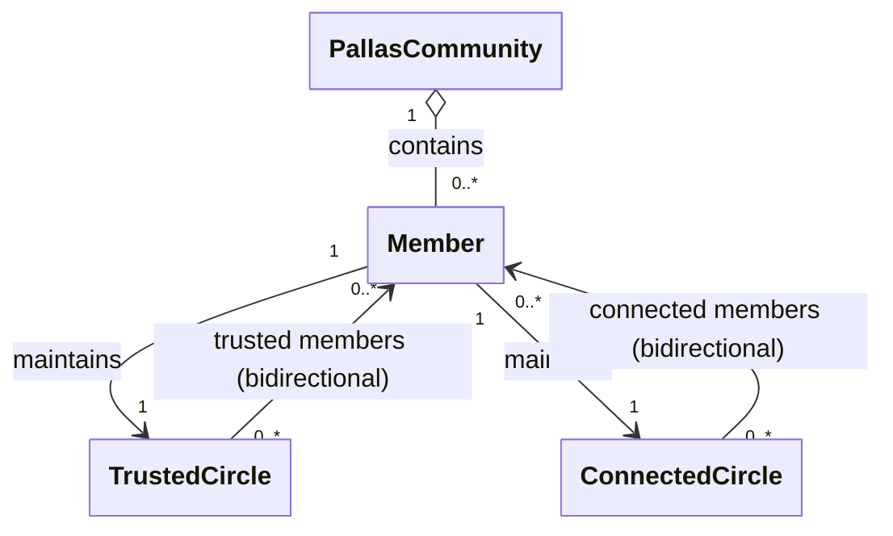

# Core Models

This chapter describes the core domain models of Pallas Today. These models are central to the platform and are
referenced across all services.

______________________________________________________________________

## Member

A **member** is a registered participant of Pallas Today.

- Needs further refinement.

______________________________________________________________________

## Member Network

Every member belongs to the **Pallas Community**: the complete set of all registered members. Within this community,
members can discover one another, but access to content and profile information is limited by the relationship between
them.

Each member maintains two personal circles of relationships:

- **Trusted circle** — the set of members a member considers close. This represents a strong, intimate connection.
- **Connected circle** — the set of members a member is connected with, but at a lower level of intimacy.

Relationships in both circles are **bidirectional**: if member A includes member B in their trusted circle, then member
B also has member A in their trusted circle. Neither circle can exist asymmetrically.

These two circles, combined with the broader community and the absence of any relationship, define four distinct
relationship types that the platform recognises between any two parties:

| Relationship          | Description                                                            |
| --------------------- | ---------------------------------------------------------------------- |
| **Trusted members**   | Members within each other's trusted circle.                            |
| **Connected members** | Members within each other's connected circle.                          |
| **Community members** | Members of the Pallas Community who share no direct circle membership. |
| **Guests**            | People who are not a member of the Pallas Community at all.            |

The relationship type between two parties determines what content and profile data each can access, forming the
foundation of the platform's privacy model.

