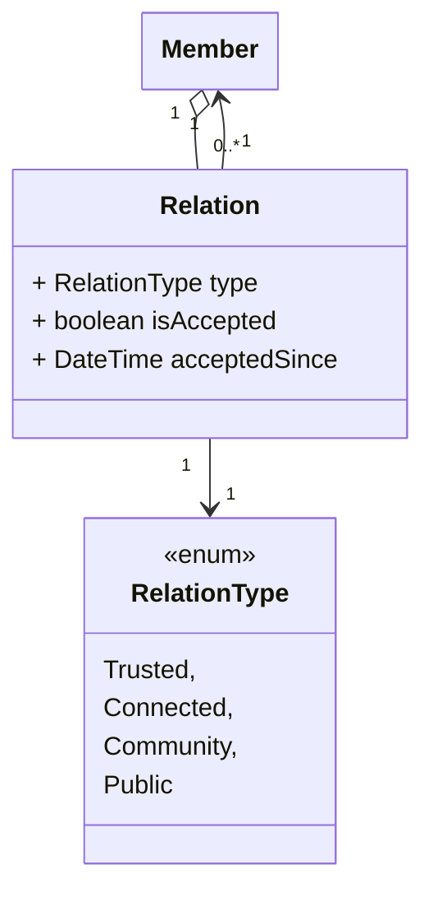
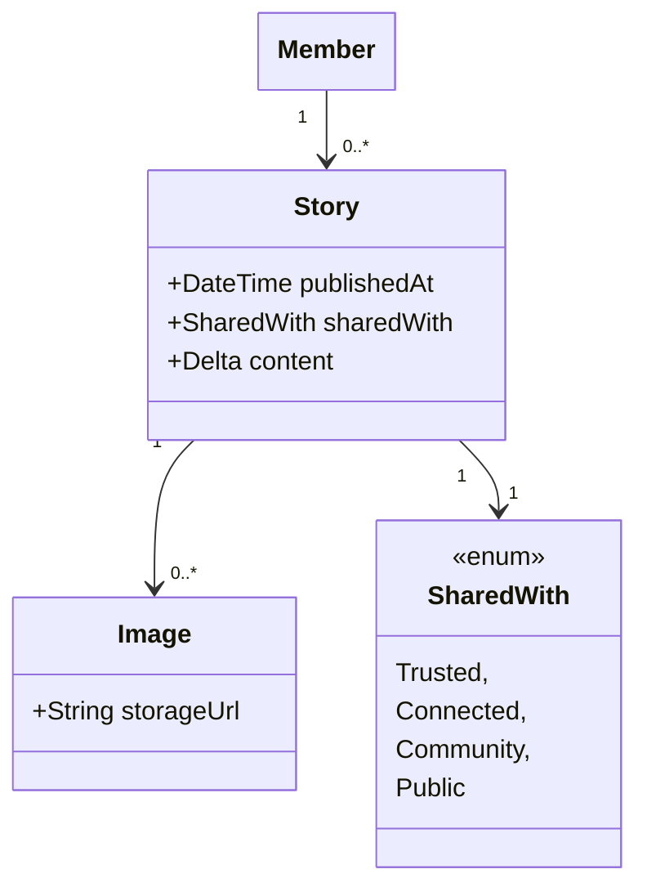

# Core Models

This chapter describes the core domain models of Pallas Today. These models are central to the platform and are
referenced across all services.

______________________________________________________________________

## Member Network

Every member belongs to the **Pallas Community**: the complete set of all registered members. Within this community,
members can discover one another, but access to content and profile information is limited by the relationship between
them.

Each member maintains two personal circles of relationships:

- **Trusted circle** — the set of members a member considers close. This represents a strong, intimate connection.
- **Connected circle** — the set of members a member is connected with, but at a lower level of intimacy.

Relationships in both circles are **bidirectional**: if member A includes member B in their trusted circle, then member
B also has member A in their trusted circle. Neither circle can exist asymmetrically.

These two circles, combined with the broader community and the absence of any relationship, define four distinct
relationship types that the platform recognises between any two parties:

| Relationship          | Description                                                            |
| --------------------- | ---------------------------------------------------------------------- |
| **Trusted members**   | Members within each other's trusted circle.                            |
| **Connected members** | Members within each other's connected circle.                          |
| **Community members** | Members of the Pallas Community who share no direct circle membership. |
| **Guests**            | People who are not a member of the Pallas Community at all.            |

The relationship type between two parties determines what content and profile data each can access, forming the
foundation of the platform's privacy model.

### Relationship modification

Changing the relationship between two members follows different flows depending on the direction of the change:

- **Strengthening the bond** (moving to a closer circle): the initiating member sends a **connection suggestion** to the
  other member. The receiving member must explicitly accept or reject it. The relationship only changes upon acceptance.
- **Easing the relationship** (moving to a more distant circle or removing it): the change is applied immediately and
  without requiring consent from the other member.

## Stories

A **story** is the primary means by which members share content with one another on the platform. A story can describe
an event in a member's life, express an emotion, or convey anything the author wishes to communicate. Stories are
rich-text documents: the content is authored in a structured editor and stored as a **JSON Delta** — the format defined
by the Quill.js Delta specification, representing the document as an ordered array of insert operations with optional
formatting attributes.

### Visibility: Shared With

Every story carries a **Shared With** modifier that determines who may read it. The author selects one of the following
levels when publishing a story:

| Shared With   | Who can see the story                                                   |
| ------------- | ----------------------------------------------------------------------- |
| **Trusted**   | Members in the author's trusted circle. This is the default.            |
| **Connected** | Members in the author's connected circle.                               |
| **Community** | All registered members of the Pallas Community.                         |
| **Public**    | Everyone, including guests who are not members of the Pallas Community. |

Only members whose relationship with the author meets or exceeds the selected level can see the story. Members outside
that audience receive no indication that the story exists.

### Stories near you

Each member has a personalised feed called **Stories near you**. This feed aggregates the stories published by:

- the member themselves,
- members in their trusted circle, and
- members in their connected circle.

Stories are sorted chronologically, with the most recently published story at the top.

Members may also browse the **Stories near you** board of another member. Because visibility is always governed by the
**Shared With** modifier of each individual story, the board shown to a visitor will differ from what the subject member
sees for themselves: stories not shared with the visiting member are silently excluded.

### Technical details

- **Content format** — story content is stored as a JSON Delta document. Text, formatting, and embedded image references
  are all encoded within this structure.
- **Images** — images embedded in a story are uploaded separately to file storage. Only the resulting URL is stored
  inside the Delta document. Images are owned by their story: when a story is deleted, all associated images must be
  deleted from file storage as well. An image inherits the **Shared With** modifier of its owning story — an image is
  accessible to exactly the same audience as the story it belongs to.
- **Timestamp** — each story records the date and time at which it was published. This timestamp is used to order
  stories in the **Stories near you** feed.
- **Shared With** — the access modifier is stored as a field on the story and is evaluated on every read request to
  determine whether the requesting member is permitted to see the story.
